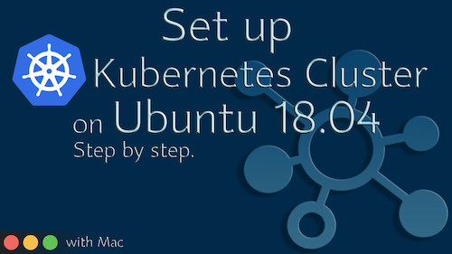

<h1>Set up Kubernetes on AWS EC2 Ubuntu 18.04 Instance</h1>
<p>Prepared by Vytautas Bielinskas, 2021.<br>
Video of steps explained: <a href="https://www.youtube.com/c/VytautasBielinskas">Set up Kubernetes on AWS EC2 Instance</a><br>LinkedIn profile: <a href="https://www.linkedin.com/in/bielinskas/">here</a></p>

---

<h2>Prerequisites</h2>
<p>To sucessfully complete this tutorial you should: 
<ul>
  <li>have an active AWS Account.</li>
  <li>basic understanding of Unix terminal commands.</li>
  <li>basic understanding of Docker.</li>
</ul>
If you say yes to all these requirements, we can start.
</p>

<h2>How to read this tutorial?</h2>
<p>This tutorial provides clear steps and commands which must be executed sequentially as it is listed. I strongly recommend not to skip any step, except <i>Workaround</i> step if all forward commands will no raise any errors. Video version of the tutorial is available <a href="https://youtu.be/SQJxYhfzznU">here</a>.</p>

<h3>The structure of the tutorial</h3>
<p>This tutorial covers the following steps which you can execute on your side sequantially:
<ul>
  <li><b>Step 1.</b> Set up AWS EC2 Ubuntu 18.04 Instance.</li>
  <li><b>Step 2.</b> Connect to EC2 Instance from local terminal.
    <ul>
      <li><b>2.1.</b> Make your private key (<i>.pem</i>) executable.</li>
      <li><b>2.2.</b> Connect to all nodes from instances.</li>
    </ul>
  </li>
  <li><b>Step 3.</b> Install dependencies and configure Kubernetes.
    <ul>
      <li><b>3.1.</b> Update the package list.</li>
      <li><b>3.2.</b> Install Docker.</li>
      <li><b>3.3.</b> Check Docker version.</li>
      <li><b>3.4.</b> Start and enable Docker.</li>
    </ul>  
  </li>
  <li><b>Step 4.</b> Install Kubernets on Ubuntu 18.04.
    <ul>
      <li><b>4.1.</b> Add a Signing Key (<i>GPG</i>).</li>
      <li><b>4.2.</b> Add the Kubernetes software repository.</li>
    </ul>
  </li>
  <li><b>Step 5.</b> Prepare Kubernetes installation tools.
    <ul>
      <li><b>5.1.</b> Install <i>kubeadm</i>, <i>kubelet</i>, and <i>kubectl</i>.</li>
      <li><b>5.2.</b> Check if <i>kubeadm</i>, <i>kubelet</i>, and <i>kubectl</i> are on hold.</li>
    </ul>  
  </li>
  <li><b>Step 6.</b> Kubernetes Deployment.
     <ul>
      <li><b>6.1.</b> Disable the swap memory from nodes.</li>
      <li><b>6.2.</b> Set host names for each node.</li>
    </ul> 
  </li>
  <li><b>Step 7.</b> Workaround to avoid mismatches between Docker drivers (<i>optional step</i>).
     <ul>
       <li><b>7.1.</b> Create a <i>daemon.json</i> file.</li>
       <li><b>7.2.</b> Reset Docker and <i>kubeadm</i> services.</li>
    </ul>   
  </li>
  <li><b>Step 8.</b> Initialize Kubernetes Pod Network.
    <ul>
      <li><b>8.1</b> Set up a Pod Network for Master node.</li>
      <li><b>8.2</b> Create a directory for the initialized Master node.</li>
      <li><b>8.3</b> Set up a virtual network for communication across nodes (<i>flannel</i>).</li>
      <li><b>8.4</b> Check the pods status</li>
      <li><b>8.5.</b> Join Worker nodes to a Master node</li>
    </ul>  
  </li>
  <li><b>Step 9.</b> Check final stages.
    <ul>
      <li><b>9.1</b> Confirm that Master node communicates with all Worker nodes.</li>
    </u>
  </li>
</ul>
</p>

<h2>Step 1. Set up AWS EC2 Ubuntu 18.04 Instance</h2>
<p>In this step we will closely work on initialzied AWS EC2 instances. Keep in mind that in order to complete this part sucessfully, you should be opened all 3 terminal windows during all steps. Here 1 terminal window is dedicated to <b>Master slave</b>, while other two to <b>Worker nodes</b>. So in total we are having 3 nodes (1 + 2).<br>Noticing that this manual was prepared in Mac, so slightly differences may be using different OS, such as Windows.</p>
  
<h3>1.1. Prepare your SSH Private key for safe connections</h3>
<p>First of all, put you SSH key to a special folder in your machine. Keep SSH key filnename be easy to type and recognize such as <i>kubernetes-dev.pem</i> (we will use this filename furthermore in this manual).</p>
<p>Before all forwarding steps, you must to allow your <i>.pem</i> file be executable in your system. To do this, type and enter following command:</p>

```
chmod 400 kubernetes-dev.pem 
```

As a result you should see granted access to your <i>.pem</i> file - type <code>ls -la</code> command to see the effect:

```commandline
-r--------@    1 usename  staff   1700 Nov 16 07:14 kubernetes-dev.pem
```

<p><b>Important:</b> Replace example <i>Public IP</i> with your in your command. Please make connections to all <b>3</b> nodes by changing the <i>Public IP</i> respectively.</p>

<h2>2. Connect to your Ubuntu instance from terminal</h3>
<p>Once you made your private key (<i>.pem</i>) executable, you are ready to use it to make connection to your Ubuntu instance from your terminal. You can do it with the following command:</p>

```
ssh -i kubernetes-dev.pem ubuntu@18.117.218.51
```

This setting ensure safe connection to instances to execute next steps. 
</p>

<h2>Step 3. Install dependencies and configure Kubernetes</h3>
<p>
In this part we will install Docker and Kubernetes packages into all 3 nodes, then enable them to work. In addition to that we will prepare Kubernetes tools such as <code>kubectl</code>, and <code>kubeadm</code> once they are mandatory for set up.
</p>
<p><b><u>Important:</b> Following steps must be executed in all your nodes, included Master and Worker nodes in paraller.</u></p>

<h3>3.1. Update the package list</h3>
<p>You can update the package list in you Ubuntu instance with the following command:</p>

```commandline
sudo apt-get update
```

<h3>3.2. Install Docker</h3>
<p>To install Docker on your Ubuntu instance (all nodes) you should use the following command:</p>

```
sudo apt-get install docker.io
```

<h3>3.3. Check Docker version</h3>
<p>Once you install Docker on your nodes, you can easily check the version of just installed Docker to be sure that is installed sucessfully with following command:</p>

```
docker --version
```
</p>

<h3>3.4. Start and enable Docker</h3>
Once you installed Docker in a previous step, you should to start and enable for a work it by type and enter following commands.
  
```commandline
# Set Docker to launch at boot
sudo systemctl enable docker
# Verify that Docker is running now
sudo systemctl status docker
# If not running, try this:
sudo systemctl start docker
```
</p>

<h2>Step 4. Install Kubernetes on Ubuntu 18.04</h2>
<p>
To have our instances set up correctly, by side of Docker, we must to install a Kubernetes service. Kubernetes used to orchestrate Docker images, scale up and down based on real-time demand, and it also has number of benefits. </p>

<h3>4.1. Add a Signing Key (GPG)</h3>
<p>Since you are downloading Kubernetes from a non-standard repository, it is essential to ensure that the software is authentic. So we need to add a signing key (with extenstion <code>gpg</code>).<br>
To add a GPG key, type and enter following coomand:</p>
  
```commandline
curl -s https://packages.cloud.google.com/apt/doc/apt-key.gpg | sudo apt-key add
```

<h3>4.2. Add the Kubernetes software repository</h3>
<p>Once you sucessfully added a signing key, you have to add software repository with the following command:</p>
  
```commandline
sudo apt-add-repository "deb http://apt.kubernetes.io/ kubernetes-xenial main"
```

<h2>Step 5. Prepare Kubernetes installations tools</h2>
<p>With this step we will prepare the required Kubernetes tools to start and complete configuration of nodes.</p>

<h3>5.1. Install <i>kubeadm</i>, <i>kubelet</i>, and <i>kubectl</i></h3>
<p>Here we will install <code>kubeadm</code>, <code>kubelet</code>, and <code>kubectl</code> tools. These tools are required for cluster initializing and managing. To install all these tools, type and enter following commands:</p>
  
```commandline
sudo apt-get install kubeadm kubelet kubectl
```

<h3>5.2. Check if <i>kubeadm</i>, <i>kubelet</i>, and <i>kubectl</i> are on hold</h3>
<p>Once we have installed <i>kubeadm</i>, <i>kubelet</i>, and <i>kubectl</i> tools, now we need to be sure that these tools are active. In other words saying, we need to check if they are on hold. We can do it with the following command:</p>

```commandline
sudo apt-mark hold kubeadm kubelet kubectl  
```

<p>As the output, you should see three lines of text indicating that these tools are on hold now. If yes, go to the next step.</p>

<h3>5.3. Check <i>kubeadm</i> version</h3>
  
<p>When you are completed the previous step, be sure that the installations was sucessfull. To do it, verify the installation and check the version of installed <code>kubeadm</code> with the following command: </p>
  
```commandline
kubeadm version
```
If you done all previous steps correctly, no any erros should raises. You should see some version data and metadata related to your Kubenetes version.
</p>

<h2>Step 6. Kubernetes Deployment</h2>
<p>With this part we will start the deployment process for freshly installed Kubernetes on our EC2 instances for all nodes. Keep executre following commands for all 3 nodes.</p>

<h3>6.1.Disable the swap memory from each node</h3>
<p>Swap is hard disk space used as RAM. It is (relatively speaking) very slow, but stops computers from crashing when they are trying to deal with more data then their RAM can handle. Before initializing the internal Kubernetes network on our instances, you must the disable the swap memory from each node with the following command:</p>

```commandline
sudo swapoff -a
```
If no any error occurs on your side, keep going.
</p>

  <h3>6.2. Set a host name for each node</h3>
Here we need to set meaningful host names for each of node. The purpose of this step is to easily recognize which node is Master, ans which ones are Worker nodes in our deployment processes. You should set host names to each instance separately:
  
<ul>
  <li>For <b>Master</b> node: <code>sudo hostnamectl set-hostname master-node</code></li>
  <li>For <b>Worker</b> node 1: <code>sudo hostnamectl set-hostname worker-1</code></li>
  <li>For <b>Worker</b> node 2: <code>sudo hostnamectl set-hostname worker-2</code></li>
</ul>
You can set host names as you want, once there are no any strictly rules on that. Just keep in mind that the names should be meaningful, it will make you life easier for later.
</p>

<h2>Step 7. Workaround to avoid mismatches between Docker drivers</h3>
  
  > <b>Important</b>: this step is optional as some instances raises error due to mismatches between installed drivers in the next steps. I recommend to apply this workaround to avoid such issues. You must to implement this workaround in all your nodes.
  
<p>The main idea of this workaround step is to create <i>daemon.json</i> file with specified content inside in <i>/etc/docker/</i> dircetory to avoid mismatches among drivers and make Kubernetes run healthly. In this step, you should be at least familiar with some Linux commands, such as <code>vi</code>, and <code>touch</code>.</p>

<h3>7.1. Create a <i>daemon.json</i>file</h3>

<p>Firstly you need to navigate to <i>/etc/docker/</i> folder from you current location in the server. Then you should create a new JSON file with the command <code>touch</code> as follows.</p>
  
```commandline
cd ../../etc/docker
sudo touch daemon.json
```
  
  Once you have created <i>daemon.json</i>, you must to fill this file with specified content inside as below. First of all, open this JSON file for editing with <code>vi</code> command:
  
```commandline
sudo vi daemon.json 
```
  
Once you are entered to editing space, type (or copy and paste) this conent:
  
```commandline
{
"exec-opts": ["native.cgroupdriver=systemd"]
} 
```
  
Be sure that you pasted this content correctly, and exit with save the file with the hotkey <code>:wq</code>.
</p>

<h3>7.2. Reset Docker and <i>kubeadm</i> services</h3>
<p>Now you need to restart your Docker service and <code>kubeadm</code> initialization in new conditions with the following commands:

```commandline
sudo systemctl restart docker
sudo kubeadm reset
```
  
If no errors raised, you are ready to initialize your Kubernetes network on a Master node.
</p>

<h2>Step 8. Initialize Kubernetes Pod Network</h2>
This step is quite large comparing with the rest steps, so be ready to make following steps carefully without interpution. This step must be performed in Master node only. With this step you will create Pod network in your Master node, which is required for Cluster communicating with its nodes. 

<h3>8.1. Set up a Pod Network for Master node</h3>

<p>I think this step is the most important one, and asnwer to the question - <i>are all steps we made before were correct</i>? So, you can initialize your Kubernetes Pod Network on your Master node with the following command:</p>
  
```commandline
sudo kubeadm init --pod-network-cidr=10.244.0.0/16
```
  
The execution of this command can take approximatelly 2-3 minutes. At the end, you should get a quite large output with <code>join</code> command at the very end (we will use it in the next step to connect Worker nodes to Master node), and some basic commands in the beginning of output message. I strongly recommend to copy the whole output message for further use. The example of the output for the executed command is below:
</p>

```commandline
Your Kubernetes control-plane has initialized successfully!

To start using your cluster, you need to run the following as a regular user:

  mkdir -p $HOME/.kube
  sudo cp -i /etc/kubernetes/admin.conf $HOME/.kube/config
  sudo chown $(id -u):$(id -g) $HOME/.kube/config

Alternatively, if you are the root user, you can run:

  export KUBECONFIG=/etc/kubernetes/admin.conf

You should now deploy a pod network to the cluster.
Run "kubectl apply -f [podnetwork].yaml" with one of the options listed at:
  https://kubernetes.io/docs/concepts/cluster-administration/addons/

Then you can join any number of worker nodes by running the following on each as root:

kubeadm join 172.31.37.224:6443 --token 2jcb53.krt1i08yljnnkyqb \
	--discovery-token-ca-cert-hash sha256:c6ef8a3b52fa8cc22f8933f502b61ce56b0ec135af9c5d1b503c8d1876a1a961 
```

<p>This outputs provides you a lot of guidelines what to do further. Keep <code>join</code> token very carefully, we will use it to join Worker nodes to the Master node.</p>

<h3>8.2. Create a directory for the initialized Master node</h3>

<p>As the generated output to the <i>init</i> command suggest, first of all after this, we need to create a special directory in the Master node, just copying and pasting lines from the output, as follows:</p>

```commandline
mkdir -p $HOME/.kube
sudo cp -i /etc/kubernetes/admin.conf $HOME/.kube/config
sudo chown $(id -u):$(id -g) $HOME/.kube/config
```

<p>If no any errors raised, you sucessfully created a required directory for the Cluster.</p>

<h3>8.3. Set up a virtual network for comunication across nodes (<i>flannel</i>)</h3>

<p>As <a href = "https://kubernetes.io/docs/concepts/cluster-administration/networking/">official Kubernetes docummentation</a> says, Flannel is a very simple overlay network that satisfies the Kubernetes requirements. Many people have reported success with Flannel and Kubernetes. In other words, Flannel is a simple and easy way to configure a layer 3 network fabric designed for Kubernetes.
</p>

<p>You can initialize a new <i>flannel</i> network for you Kubernetes Cluster with this command:</p>

```commandline
sudo kubectl apply -f https://raw.githubusercontent.com/coreos/flannel/master/Documentation/kube-flannel.yml
```

<p>The loaded <i>kube-flannel.yml</i> file contain all instructions to install this network on you Cluster.</p>

<h3>8.4. Check the pods status</h3>
<p>A pod is the smallest execution unit in Kubernetes. A pod encapsulates one or more applications. Pods are ephemeral by nature, if a pod (or the node it executes on) fails, Kubernetes can automatically create a new replica of that pod to continue operations. Pods include one or more containers (such as Docker containers) (<a href="https://www.vmware.com/topics/glossary/content/kubernetes-pods">source</a>).</p>

<p>Once you sucessfully initialized a new <i>flannel</i> network on your Kubernetes Cluster, it is a good time to check pods status. You can do it with the following command:</p>

```commandline
kubectl get pods --all-namespaces
```

<p>On the generated output you should see that all your pods on you Master node are running.</p>

<h3>8.5. Join Worker nodes to a Master node</h3>
<p>This is the (almost) last step in this tutorial. So, as the <code>init</code> output suggest, we also need to connect our two (or more) Worker nodes to a Master node in a correct way, with generated <code>join</code> token. This is the last line in the mentioned output, starting with <code>kubeadm join 172.31.37...</code>.</p>
<p>I recommend to delete <code>\</code> from the command and by doing this to make a single line instead of two lines. As a result to this, you should see similar command structure as this:</p>

```commandline
kubeadm join 172.31.37.224:6443 --token 2jcb53.krt1i08yljnnkyqb --discovery-token-ca-cert-hash sha256:c6ef8a3b52fa8cc22f8933f502b61ce56b0ec135af9c5d1b503c8d1876a1a961 
```

<p>So run it! As a result, you should get a output indicating that your Worker nodes are now connected to your Master node.</p>

<h2>Step 9. Check final stages</h2>

<p>If you are in this step, I assume you sucessfully completed all previous steps. To be sure that everything is fine, let's check the final status of our Cluster with this command:</p>

```commandline
sudo kubectl get nodes
```

<p>The output to this should be list of the nodes, indicating that they (<i>Master node</i>, <i>Worker-1</i>, and <i>Worker-2</i> are running, or they are <i>running</i>, including <i>VERSION</i> and <i>AGE</i> If you see that, gongratulation with finishing this big tutorial!</p>


---

<h2>Video of this tutorial is available - ALL STEPS EXPLAINED!</h2>
<p>If you prefer video format of learning instead of reading Readme tutorials, or wish to combine boths, here you go, enjoy this carefully prepared video on Youtube!

<a href="https://youtu.be/SQJxYhfzznU">
  
</a>
</p>
